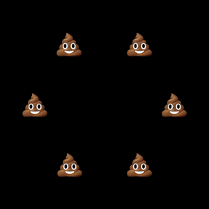

# dpop

踊るうんこのgif画像を生成します。

出力の例：



## 使い方

今のところ以下のOSでのみ動作します。OS依存の部分はフォントの指定のところだけだと思われます。

- MacOS
- Linux
  - フォント`/usr/share/fonts/truetype/ancient-scripts/Symbola_hint.ttf`があることが前提です
  - フォントのインストールは[こちら](https://qiita.com/polamjag/items/7295a15fca6a9eeb5d84#%E3%82%A4%E3%83%B3%E3%82%B9%E3%83%88%E3%83%BC%E3%83%AB%E6%96%B9%E6%B3%95)を参照してください。

Python3がインストールされていることを前提とします。

まず、以下のコマンドを実行してコマンドをインストールします。

```shellsession
> pip install dpop
```

以下を実行するとファイルdpop.gifが生成されます。

```shellsession
> dpop
```

オプションの指定ができますが、オプションの詳細は以下を実行してください。

```shellsession
> dpop --help
```

