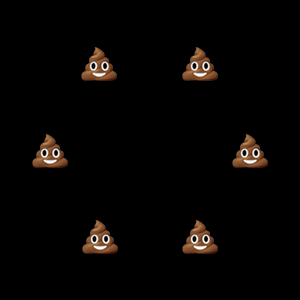

# dpop
（[日本語](README.ja.md)）

dpop stands for Dancing Piles of Poo. This program saves a gif image which shows dancing poos

Sample of output:



## How to Use

This work in the following platforms. The only platform dependent part is the specification of the font.

- macOS
- Linux
  - Needs `/usr/share/fonts/truetype/ancient-scripts/Symbola_hint.ttf`
  - Install the font beforehand

This works on Python3.

To install, enter the command as follows:

```shellsession
> pip install git+https://github.com/hamukazu/dpop.git
```

Enter as follows to generate a gif file:
```shellsession
> dpop
```

There are some options. To see the options, enter:

```shellsession
> dpop --help
```

